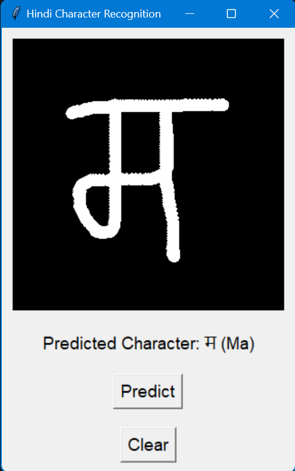
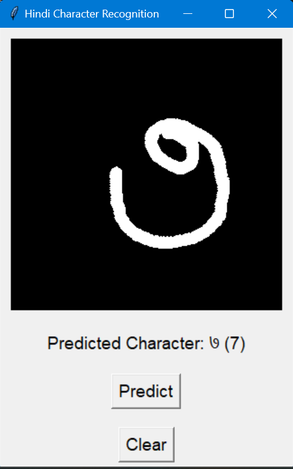
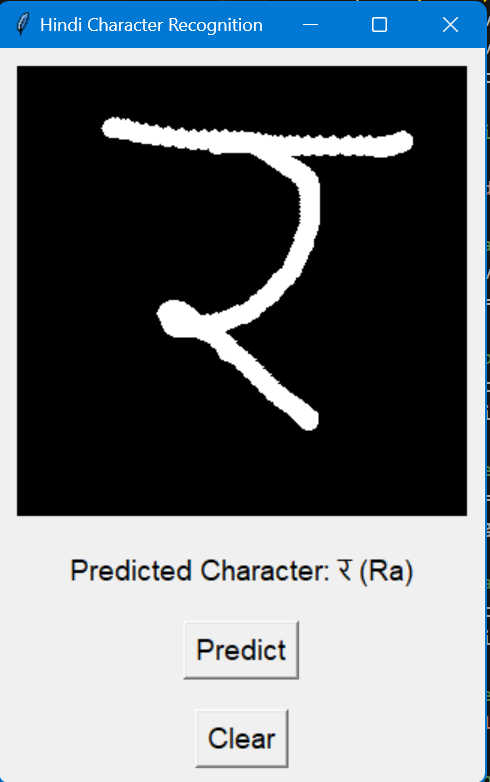

# Hindi Character Recognition Using Deep Learning

This project implements a Hindi character recognition system using **Deep Learning** (CNN). The model is trained on the **Devanagari Handwritten Character Dataset** and is capable of recognizing handwritten Hindi characters. The user can draw characters on a **Tkinter** canvas, and the model predicts the character along with its Hinglish pronunciation (e.g., "ka", "kha", "ga", "gha").




---

## Features

- **Handwritten Hindi Character Recognition**: Recognizes 46 Hindi characters from the Devanagari script.
- **User-Friendly Interface**: A simple Tkinter-based graphical user interface for drawing and predicting characters.
- **Hinglish Pronunciation**: Displays the Hinglish pronunciation of the predicted character (e.g., "ka", "kha", "ga").
- **Model**: Convolutional Neural Network (CNN) trained to classify Hindi characters.

---

## Prerequisites

Make sure you have the following installed:

- **Python 3.x**
- **TensorFlow 2.x**
- **Keras**
- **OpenCV**
- **Pillow**
- **NumPy**
- **Matplotlib**
- **Tkinter** (Usually pre-installed with Python)

### Install Dependencies

Use the following command to install all the required dependencies:

```bash
pip install -r requirements.txt
```

---

## Setup Guide

### Step 1: Clone the Repository

Clone the repository to your local machine:

```bash
git clone https://github.com/your-username/hindi-character-recognition.git
cd hindi-character-recognition
```

### Step 2: Install Dependencies

To install the necessary Python libraries, run:

```bash
pip install -r requirements.txt
```

### Step 3: Training the Model

The model is pre-trained and saved as `HindiModel2.h5`. However, if you wish to train the model yourself:

1. Download the Devanagari Handwritten Character Dataset from [here](https://archive.ics.uci.edu/ml/datasets/Devanagari+Handwritten+Character+Dataset).
2. Place the dataset in the `DevanagariHandwrittenCharacterDataset` directory.
3. Run the `train_model.py` script to train the model.

### Step 4: Run the Application

To run the application, execute:

```bash
python app.py
```

This will launch the Tkinter-based GUI. You can now draw characters and click "Predict" to get the character prediction along with the Hinglish pronunciation.

---

## Project Structure

Here’s a quick overview of the project files:

```
hindi-character-recognition/
│
├── app.py                   # Main application file with the GUI and prediction logic
├── HindiModel2.h5           # Pre-trained model for character recognition
├── requirements.txt         # List of required Python libraries
├── README.md                # Project documentation
└── DevanagariHandwrittenCharacterDataset/
    ├── Train/
    └── Test/
```

### Important Files:
- `app.py`: The main script with GUI logic for drawing and character prediction.
- `HindiModel2.h5`: Pre-trained model file.
- `requirements.txt`: Dependencies required for the project.

---

## How the Application Works

### 1. **Drawing on the Canvas**

The application allows users to draw a character on a 300x300 pixel canvas. The drawing is captured as a PNG image.



### 2. **Preprocessing and Prediction**

- The drawn character is converted to **grayscale**, resized to **32x32 pixels**, and normalized.
- It is then passed through the trained model to make a prediction.

### 3. **Displaying Prediction**

Once the model predicts the character, the application shows the **Hindi character** and its corresponding **Hinglish pronunciation**.

---

## Model Architecture

The model is based on a **Convolutional Neural Network (CNN)** with the following layers:

1. **Conv2D**: 32 filters, 3x3 kernel, ReLU activation.
2. **BatchNormalization**: Normalizes activations.
3. **MaxPooling2D**: Pooling layer with a 2x2 pool size.
4. **Conv2D**: 32 filters, 3x3 kernel, ReLU activation.
5. **BatchNormalization**: Normalizes activations.
6. **MaxPooling2D**: Pooling layer with a 2x2 pool size.
7. **Conv2D**: 64 filters, 3x3 kernel, ReLU activation.
8. **BatchNormalization**: Normalizes activations.
9. **MaxPooling2D**: Pooling layer with a 2x2 pool size.
10. **Flatten**: Converts 3D tensor to a 1D vector.
11. **Dense**: Fully connected layer with 128 neurons and ReLU activation.
12. **BatchNormalization**: Normalizes activations.
13. **Dense**: Fully connected layer with 64 neurons and ReLU activation.
14. **BatchNormalization**: Normalizes activations.
15. **Dense**: Output layer with 46 neurons (one for each character) and softmax activation.

---

## Hinglish Pronunciation

The application predicts characters and shows their **Hinglish pronunciation** (e.g., "ka", "kha", "ga") for the recognized Hindi character. Below is a table of some characters and their pronunciations:

| **Hindi Character** | **Pronunciation** |
|---------------------|-------------------|
| क                   | ka                |
| ख                   | kha               |
| ग                   | ga                |
| घ                   | gha               |
| च                   | cha               |
| छ                   | chha              |
| ...                 | ...               |

---

## License

This dataset is licensed under a Creative Commons Attribution 4.0 International (CC BY 4.0) license.
---

## Acknowledgements

- **Devanagari Handwritten Character Dataset** by 
S. Acharya and P. Gyawali. "Devanagari Handwritten Character Dataset," UCI Machine Learning Repository, 2015. [Online]. Available: https://doi.org/10.24432/C5XS53.

For the Dataset 
[Click Here](https://archive.ics.uci.edu/ml/datasets/Devanagari+Handwritten+Character+Dataset).

- **TensorFlow** and **Keras** for deep learning model development.
- **Tkinter** for creating the GUI interface.

---

## Contact

For any queries, suggestions, or improvements, feel free to reach out! 
The dataset still misses the swar from hindi varnmala you can add them 

---